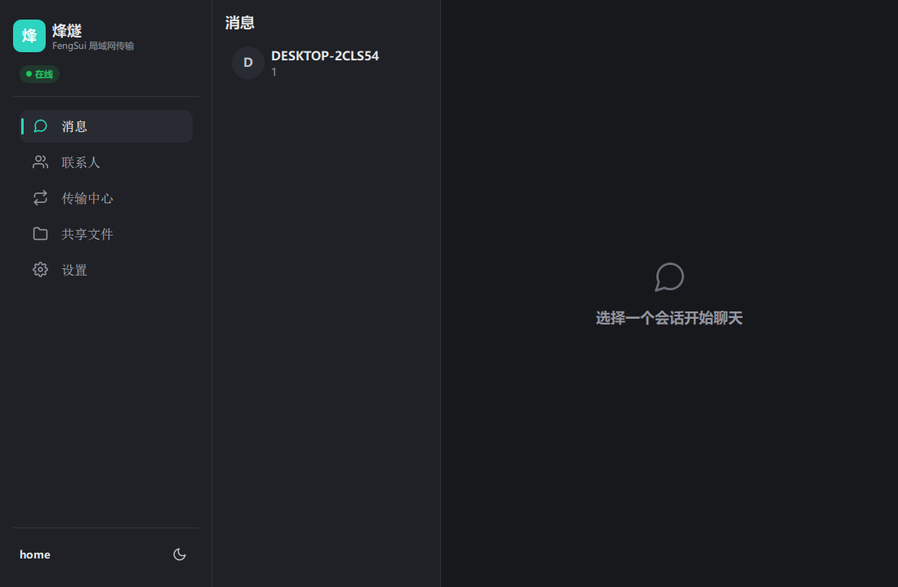
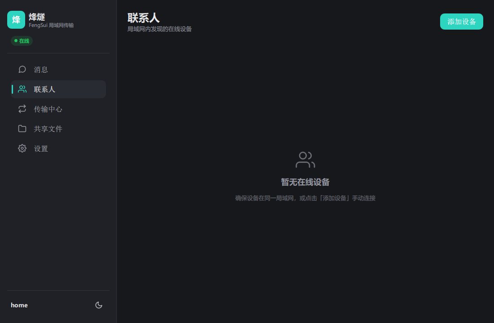
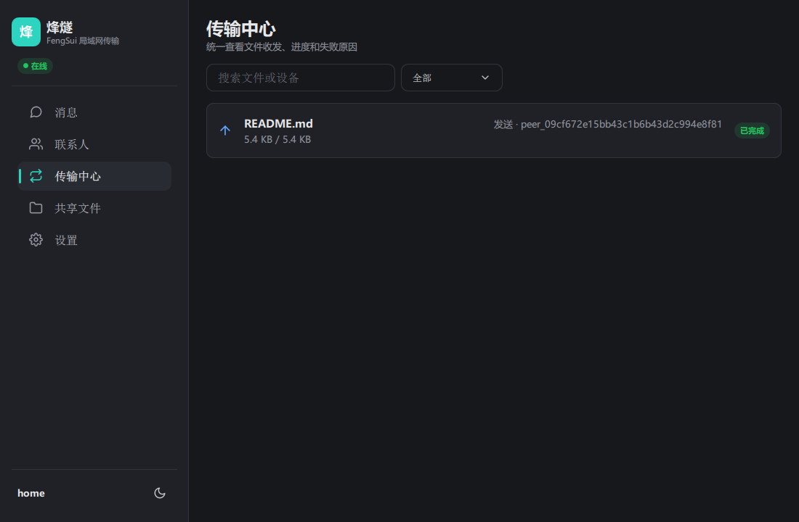
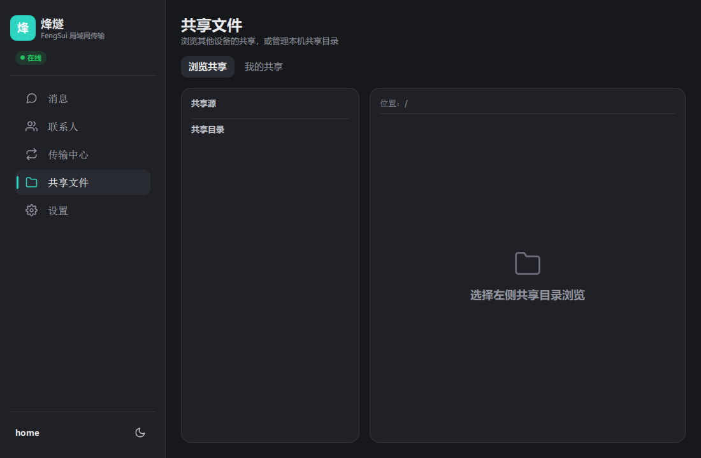

# 🔥 烽燧 FengSui

[](LICENSE)
[](https://www.qt.io/)
[](https://en.cppreference.com/)
[](#)
[](https://cmake.org/)

[English](README.md) | 简体中文

---

**烽燧 FengSui** 是一个基于 Qt 6 和 C++17 的轻量级无服务器局域网消息与文件共享桌面应用。它帮助同网段内的团队互相发现、聊天、传输文件和共享目录 — 无需云端、无需互联网、无需部署服务器。

> 烽燧不是企业 IM、网盘或办公套件。它的目标更纯粹：把"同一个网络里，需要沟通和交换文件"的日常流程做得快速、本地优先、可审查。

---

## 📋 目录

- [✨ 功能特性](#-功能特性)
- [🖼️ 界面截图](#-界面截图)
- [🚀 快速开始](#-快速开始)
- [🏗️ 架构设计](#-架构设计)
- [📦 从源码构建](#-从源码构建)
- [📁 仓库结构](#-仓库结构)
- [🧪 测试](#-测试)
- [⚠️ 当前限制](#-当前限制)
- [🤝 参与贡献](#-参与贡献)
- [🔒 安全说明](#-安全说明)
- [📄 许可证](#-许可证)

---

## ✨ 功能特性

### 🔍 设备发现
- **UDP 广播自动发现** — 同子网设备数秒内出现在列表中
- **手动 IP 连接** — 广播不可用时通过 `IP:端口` 手动添加，支持 TCP 连通性探测

### 💬 消息聊天
- **一对一文本会话** — 实时消息，本地 SQLite 持久化
- **聊天记录** — 所有会话在重启后保留，可回溯任意历史消息

### 📎 文件传输
- **TCP 单文件传输** — 拖拽文件即发送，支持接受 / 拒绝 / 取消
- **实时进度** — 传输中显示百分比、速度和预估时间
- **传输中心** — 统一面板，筛选、排序和查看所有历史与进行中的传输任务

### 📂 共享文件夹
- **发布本地目录** — 一键将任意文件夹设为共享
- **远端浏览** — 查看其他设备的共享目录，支持子目录导航
- **按需下载** — 从共享文件夹中选择单个文件下载
- **访问授权** — 他人请求访问时弹出授权窗口，可选择允许或拒绝

### ⚙️ 系统功能
- **首次引导向导** — 3 步完成：设备命名 → 发现偏好 → 默认下载目录
- **设置与诊断** — 网络策略、网卡列表、手动连接管理、内建连通性检测
- **暗色 / 亮色主题** — 运行时切换或跟随系统（`--theme dark|light`）
- **软件渲染回退** — 在远程桌面、无头或无可用 OpenGL 的环境中自动降级
- **跨平台** — Windows、Linux（Ubuntu/Debian/openKylin）、macOS

---

## 🖼️ 界面截图

| 消息                                        | 联系人                                            |
|-------------------------------------------|------------------------------------------------|
|  |  |

| 传输中心 | 共享文件 |
|---|---|
|  |  |

开发阶段可通过以下命令重新生成快照：

```bash
./fengsui --screenshot assets/screenshots/chat-dark.png --screenshot-page chat --theme dark
```

---

## 🚀 快速开始

### 环境要求

| 依赖 | 版本 |
|---|---|
| Qt | 6.8 或更新 |
| CMake | 3.20 或更新 |
| 编译器 | 支持 C++17（MSVC 2022、GCC 11+、Clang 14+）|
| Ninja | 可选，推荐用于本地构建 |

### 一行构建

```bash
cmake -B cmake-build-debug -G Ninja -DCMAKE_BUILD_TYPE=Debug \
  && cmake --build cmake-build-debug
```

### 运行

```bash
# Windows
.\cmake-build-debug\fengsui.exe

# Linux / macOS
./cmake-build-debug/fengsui
```

在同一局域网（或同一台机器使用不同端口）启动两个实例即可测试发现和消息功能。

---

## 🏗️ 架构设计

```
┌─────────────────────────────────────────┐
│  QML / Qt Quick 界面层                  │
│  pages · components · dialogs           │
│  (Main.qml → AppController 单例)        │
├─────────────────────────────────────────┤
│  C++ ViewModel 桥接层                   │
│  QAbstractListModel / QObject            │
│  QML_ELEMENT · QML_FOREIGN_NAMESPACE    │
├─────────────────────────────────────────┤
│  应用服务层                             │
│  Beacon · Signal · Courier · Share      │
│  TcpProbe                               │
├─────────────────────────────────────────┤
│  网络层                  │  存储层       │
│  UDP · TCP · Protocol    │  SQLite      │
└─────────────────────────────────────────┘
```

**数据流向：** `QML View` → `ViewModel` → `Core Service` → `Network / Storage`

各层边界清晰：
- **ui/qml** — 声明式 UI，仅绑定 ViewModel 属性和信号
- **ui/viewmodels** — C++ 桥接层，在 QML 与 core 服务之间翻译
- **core** — 业务逻辑，不依赖任何 UI 类型
- **network** — 原始 socket I/O 与协议序列化
- **storage** — 唯一 SQLite 访问出口，返回纯数据结构体

---

## 📦 从源码构建

### 环境要求

- **Qt 6.8+**（模块：Core、Gui、Widgets、Qml、Quick、QuickControls2、Network、Sql）
- **CMake 3.20+**
- **C++17 编译器**（MSVC 2022、GCC 11+ 或 Clang 14+）
- **Ninja**（可选，推荐）

### 配置

```bash
cmake -B cmake-build-debug -G Ninja -DCMAKE_BUILD_TYPE=Debug
```

### 构建

```bash
cmake --build cmake-build-debug
```

### 运行

**Windows：**
```powershell
.\cmake-build-debug\fengsui.exe
```

**Linux / macOS：**
```bash
./cmake-build-debug/fengsui
```

### 开发者参数

| 参数 | 说明 |
|---|---|
| `--theme dark\|light` | 覆盖系统主题 |
| `--screenshot <路径>` | 截取窗口快照后退出（用于 CI / 无头环境） |
| `--screenshot-page <页面>` | 选择截图页面：`chat`、`contacts`、`transfer`、`share` 或 `settings` |

---

## 📁 仓库结构

```
src/
├── main.cpp              应用入口
├── app/                  应用类、设置门面、日志系统
├── core/                 业务服务层
│   ├── BeaconService     UDP 设备发现
│   ├── SignalService     TCP 消息通道
│   ├── CourierService    文件传输引擎
│   ├── ShareService      共享目录管理
│   └── TcpProbe          连通性验证
├── models/               共享结构体与枚举（Q_GADGET / Q_NAMESPACE）
├── network/              网络层
│   ├── UdpDiscovery      UDP 广播/多播收发
│   ├── TcpConnection     端到端 TCP 连接
│   ├── TcpServer         TCP 监听服务
│   └── Protocol          消息序列化（JSON）
├── storage/              SQLite 持久化层
│   ├── Database          连接与表结构管理
│   ├── SettingsRepository
│   ├── ManualPeerRepository
│   ├── ConversationRepository
│   ├── MessageRepository
│   ├── TransferRepository
│   ├── ShareRepository
│   ├── AccessGrantRepository
│   └── DownloadLogRepository
├── platform/             平台相关工具
│   ├── PlatformUtils     主机名、路径、平台检测
│   └── InterfaceEnumerator  网卡枚举
├── tests/                QtTest 测试目标
│   ├── tst_protocol、tst_storage
│   ├── tst_signal_service、tst_courier_service
│   ├── tst_share_service、tst_beacon_policy
│   ├── tst_network_policy
│   ├── tst_qml_reflection
│   └── tst_viewmodels
└── ui/                   QML 前端 + C++ ViewModel
    ├── qml/              外壳（Main.qml）、主题、JS 工具
    ├── components/       可复用控件（13 个组件）
    ├── pages/            6 个页面（联系人、聊天、传输中心、
    │                       设置、共享、引导）
    ├── dialogs/          3 个对话框（添加设备、传输请求、
    │                       共享授权）
    ├── viewmodels/       11 个 ViewModel 类（QML ↔ core 桥接）
    └── assets/           托盘图标与静态资源
```

---

## 🧪 测试

```bash
ctest --test-dir cmake-build-debug --output-on-failure
```

| 测试套件 | 覆盖范围 |
|---|---|
| `tst_protocol` | 消息序列化 / 反序列化 |
| `tst_storage` | 全部 Repository 的 SQLite CRUD |
| `tst_signal_service` | TCP 消息通道 |
| `tst_courier_service` | 文件传输引擎 |
| `tst_share_service` | 共享文件夹逻辑 |
| `tst_beacon_policy` | 发现策略与 UDP 行为 |
| `tst_network_policy` | 网络接口与策略 |
| `tst_qml_reflection` | Q_GADGET / Q_ENUM_NS 反射 + QML 枚举访问 |
| `tst_viewmodels` | ViewModel 列表模型增量行为 |

---

## ⚠️ 当前限制

| 方面 | 状态 |
|---|---|
| 加密 | 明文传输 — v1.0 假设可信局域网环境 |
| 跨子网 | 发现仅限本地子网，不支持 VLAN / 互联网穿透 |
| 文件夹传输 | 递归拖拽文件夹传输尚未完成 |
| 文件投递箱 | P1 — 计划中，尚未实现 |
| 系统托盘 | 基础托盘图标；增强行为（最小化到托盘、状态指示）计划中 |
| 浏览器访客 | P1 — HTTP 访客模式计划中 |
| 移动端 / 云端 | 不在桌面客户端范围内 |

---

## 🤝 参与贡献

欢迎贡献！请保持变更聚焦且符合现有架构：

- **UI** → QML / Qt Quick（`QtWidgets` 仅作为 Windows 托盘后端链接）
- **桥接** → C++ ViewModel（`QAbstractListModel` / `QObject` + `QML_ELEMENT`）
- **枚举** → 通过 `ui/viewmodels/QmlEnums.h` 的 `QML_FOREIGN_NAMESPACE` 暴露共享枚举
- **网络** → 仅使用 Qt Network（`QTcpSocket` / `QUdpSocket`）
- **序列化** → `QJsonDocument`（禁止 Protobuf / MessagePack）
- **分离** → 不在 `core/`、`network/`、`storage/` 中编写 UI 或 ViewModel 代码
- **测试** → 行为变更需新增或更新 QtTest 覆盖
- **范围** → 优先提交聚焦的局部变更，避免大范围无关重构

详见 [CLAUDE.md](CLAUDE.md) 和 [docs/](docs/) 目录中的详细规范。

---

## 🔒 安全说明

烽燧面向**可信本地网络**设计。当前版本以明文传输，不提供端到端加密、强身份认证或审计级访问控制。在补充这些能力之前，请勿用于保密、合规或跨组织协作场景。

---

## 📄 许可证

烽燧基于 [MIT License](LICENSE) 发布。

---

<p align="center">
  <sub>Built with Qt 6 · C++17 · zero cloud dependencies</sub>
</p>
