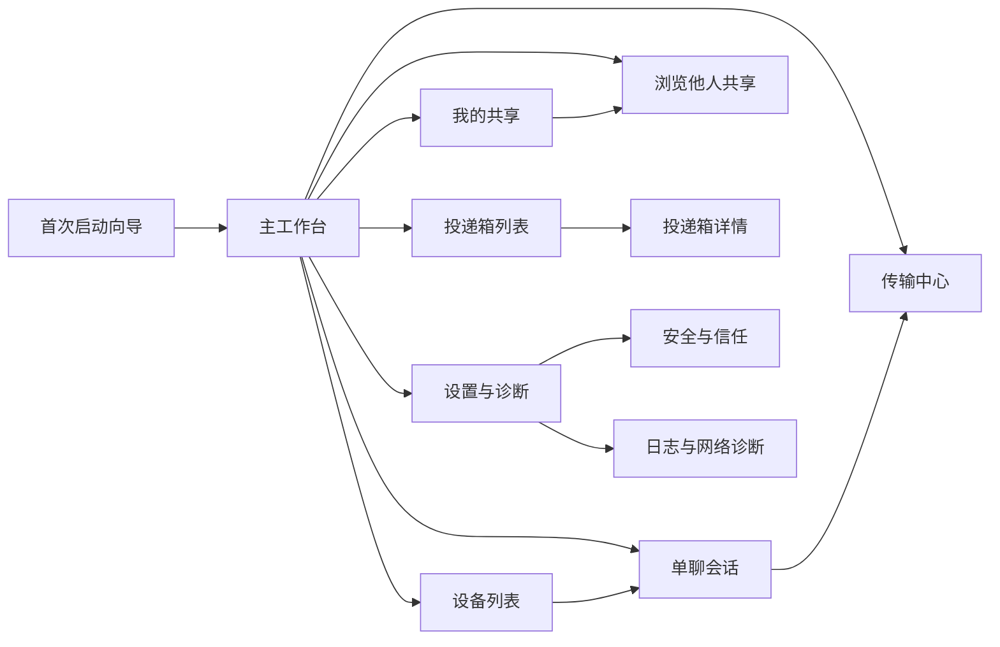
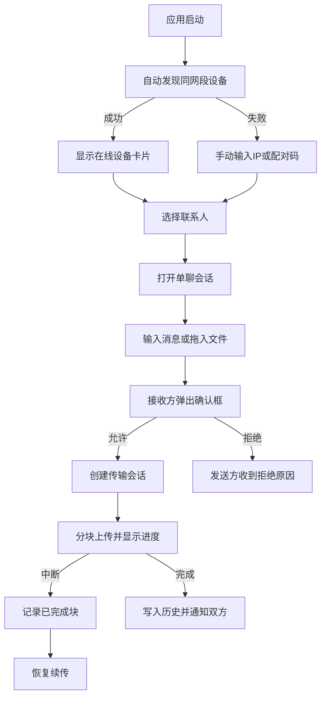
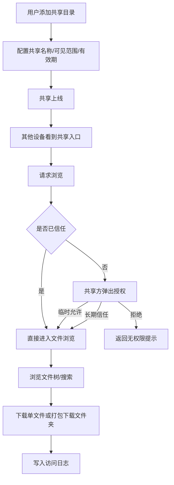
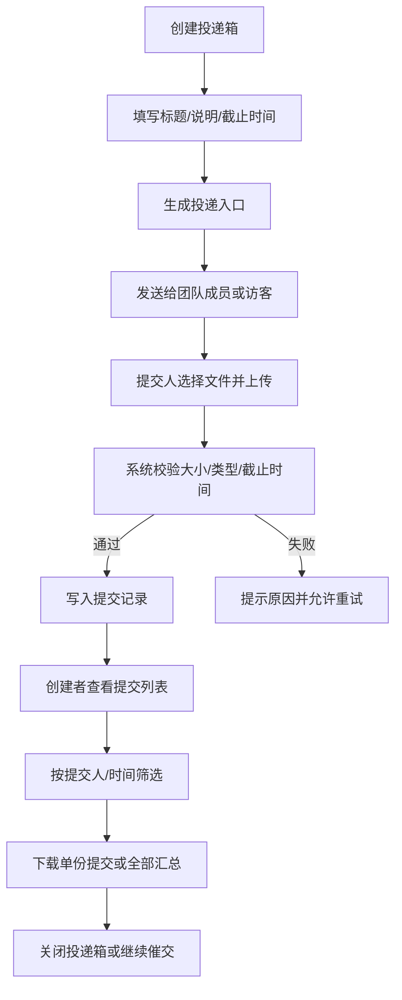

# 桌面端优先的跨平台内网轻 IM 与文件协作工具 PRD

| 文档属性 | 内容 |
|---|---|
| 文档状态 | 立项评审稿 |
| 版本 | Draft v0.9 |
| 日期 | 2026-06-04 |
| 范围 | 桌面端优先；Windows、Linux、openKylin、macOS；安卓与 iOS 为低优先级后续项 |
| 目标读者 | 产品、研发、测试、运维、投资/立项评审人员 |
| 未指定项 | 试点团队名单、目标客单价、品牌命名、银河麒麟具体客户版本、正式 UI 视觉规范 |

## 执行摘要

现有“内网沟通 + 文件协作”市场并没有消失，而是长期停留在三类割裂形态：一类是飞秋、IP Messenger、飞鸽传书这类“能用但老”的局域网工具；一类是 LocalSend、LANDrop、PairDrop 这类“跨平台但更像传输工具”的产品；另一类是有度、喧喧等“能力完整但更偏政企私有化”的平台。社区反馈高度一致：无外网或弱外网场景仍稳定存在，但用户对“老界面、缺聊天上下文、缺历史、缺共享目录、发现不稳定、来客必须装软件”的不满非常集中。

因此，本项目适合立项，但不适合一开始把自己定义成“企业微信替代品”或“全功能协同平台”。更可执行的定义是：**桌面端优先、无外网可用、默认无中心服务器、面向同网段/同办公域的轻量 IM 与文件协作工具**，先解决六件最值钱的事：看见在线设备、发消息、发大文件、浏览共享目录、投递资料、确认已读/已收。这个定义与论坛和 GitHub Issues 中暴露出的高频痛点最贴合。

MVP 建议聚焦桌面平台，优先做 **同网段发现 + 单聊 + 文件/文件夹传输 + 共享文件夹 + 投递箱 + 本地历史与诊断**，把“群聊、跨 VLAN、轻目录服务、审计后台、移动端”放到后续迭代。技术上，首选 **Qt 6 + Rust 核心**；若开发者更熟前端并追求更快原型，可考虑 **Tauri + Rust**；若未来移动端要快速接入，再考虑 **Flutter + Rust/Go**。Qt 的桌面平台覆盖和 Linux 适配面更稳，Tauri 的体积和打包链很强，但 Linux 依赖 WebKitGTK 4.1，跨发行版与麒麟/openKylin 的验证成本会更高。

安全上，**设备发现不能等于身份认证**。LocalSend 的公开协议与 2025 年安全公告都说明：仅依赖未认证的 UDP 发现会留下局域网同网段 MITM 风险。因此，本产品必须把“发现”和“信任”分层处理：发现只负责出现，真正传输前要做设备指纹、首次确认、PIN/配对码或双向签名校验。

| 高层决策项 | 建议结论 |
|---|---|
| 产品定位 | 飞秋/飞鸽的现代化替代，不做重型 OA/政企平台 |
| 首发平台 | Windows、Ubuntu/Debian 系、openKylin x86_64、macOS |
| 核心卖点 | 无外网可用、桌面友好、共享目录、投递箱、零服务器起步 |
| 推荐技术栈 | Qt 6 + Rust 核心 |
| 首发商业模式 | 免费版 + Pro + 私有部署 |
| 立项结论 | 建议立项，先做轻量、先做桌面、先把可靠性与体验做深 |

## 目录

- 项目背景与社区证据
- 产品定位与需求范围
- 详细功能设计与原型图
- 技术方案与运维部署
- 商业化、测试、里程碑与附录

## 项目背景与社区证据

### 立项判断

从官方定位看，“无服务器局域网消息与文件交换”并不是伪需求。飞秋官方仍把自己定义为局域网聊天传文件工具，强调 IPMSG 兼容、离线发送和大文件传输；IP Messenger 官方到 2026 年仍以“Serverless lightweight Messenger for LAN”对外；Softros、BeeBEEP、LAN Messenger 也全部把“无服务器、局域网、消息 + 文件、安全”作为中心卖点。BeeBEEP 甚至已经提供 BeeBOX / BeeSHARE 这类共享文件夹能力，说明“文件协作”需求并不止于单次发送。

但从社区反馈看，用户痛点已经从“有没有局域网工具”升级为“为什么不是一个现代、顺手、跨平台、轻维护的工具”。V2EX、知乎、Reddit 和 GitHub Issues 里的抱怨集中在五件事：老工具太老；现代工具又太“只会传文件”；共享目录配置仍然麻烦；发现/防火墙/跨子网不稳定；来访设备或临时协作者使用成本太高。甚至到 2026 年，仍有开发者公开表示是因为“现有工具要么过时，要么太重”才自己重做 LAN 消息应用。

本项目的机会点因此并不是“发明一种新的局域网协议”，而是做一款**更像现代桌面应用的产品**：它既要保留飞秋/IPMsg 的即时可见、无中心服务器、低启动成本，也要吸收 LocalSend/LANDrop 的跨平台易用性，还要提供最小必要的协作能力，如共享目录、投递箱、确认回执、诊断工具和访客模式。

### 目标用户与用户画像

目标用户并不是泛互联网消费者，而是**中小团队、保密/弱网团队、实验室/机房、影视素材或设计资料团队、以及存在外协或临时访客收件需求的办公室**。这一判断来自于多个真实场景：无外网办公、审计办公室需要弹窗消息和文件交换、外协同事没有工号不能登录内部 IM、办公室资料仍通过 U 盘或网络临时共享来回搬运。

| 用户画像 | 典型环境 | 当前替代方案 | 核心诉求 | 付费可能性 |
|---|---|---|---|---|
| 断网研发/测试团队 | 研发网、保密网、实验室网 | 飞秋、飞鸽、U 盘、共享文件夹 | 在线可见、消息快、传大文件、低维护 | 中高 |
| 办公室行政/财务 | 同网段 Windows 为主 | 微信文件传输助手、共享盘、QQ群临时文件 | 简单、不折腾、可追踪、可确认 | 中 |
| 设计/视频/教务资料团队 | Win + Mac + Linux 混用 | NAS、SMB、U 盘、临时压缩包 | 多平台、文件夹共享、来回收件 | 中高 |
| 外协/访客协作场景 | 临时来访设备、不便装企业 IM | 让对方装软件、扫微信、邮件 | 不装客户端也能投递/下载 | 高 |
| 小型私有化客户 | 10–100 人内网 | 轻 OA、重 IM、网盘 | 希望先轻量落地，后续可升级管理能力 | 高 |

### 关键痛点与证据归纳

| 痛点            | 证据概括                                                                                               | 对产品的要求                            |
| ------------- | -------------------------------------------------------------------------------------------------- | --------------------------------- |
| 纯内网需求长期存在     | V2EX 明确提出“没有外网、只有局域网”仍需要聊天、在线离线文件和群聊；Reddit 也有用户要“lightweight” LAN message + file transfer。        | 必须支持无外网启动即可用，不能默认依赖账号和云服务         |
| 老工具能用，但被认为过时  | V2EX 直接说“飞秋看起来似乎有些老了”；知乎多帖把“飞秋停止更新”作为问题前提；2026 年 Reddit 新项目作者也说现有工具“outdated or too heavy”。        | UI、交互、打包分发、通知与历史必须现代化             |
| 现代工具偏文件，不像 IM | LocalSend 的多个 issue 集中抱怨“文本被保存成 txt”“为什么不能像聊天一样发送”“需要消息历史”“需要内建聊天”；V2EX 也出现“局域网传文件工具凑合当聊天工具”的尴尬用法。 | 产品必须是 IM 主体，不是“会发文本的传输器”          |
| 文件共享配置复杂      | V2EX 办公室共享需求里直说“通过网络或 U 盘来共享，有些不便”，且“FTP、SAMBA、NFS 这些都没经验”；知乎也有“为什么共享文件这么难”“共享文件夹配置起来还是有点麻烦”的高频问题。 | 必须提供傻瓜式共享目录功能，避免用户自己配 SMB/FTP/NAS |
| 设备发现经常出问题     | LocalSend、LANDrop、PairDrop 均有“看不到设备”“Windows 不出现”“跨 VLAN 不行”的 issue；LocalSend 协议文档也承认需要多种发现手段。     | P0 必须有手动 IP、配对码、诊断页；跨子网只列为 P2     |
| 访客/单边安装摩擦大    | Linux.do 用户明确吐槽：“别人用手机要给我发送文件还得安装一个软件”；LocalSend 社区也长期要求无网 Web share。                              | P1 必须提供浏览器访客下载/投递模式               |

本节结论：**立项的真正方向不是“再做一个飞秋”，而是“做一个桌面时代的现代飞秋 + 轻协作工具”**。这个方向既有持续用户场景，也有明确的产品缺口。

## 产品定位与需求范围

### 产品定位与价值主张

本产品定位为：**桌面端优先的跨平台内网轻 IM 与文件协作工具**。一句话描述是：**像飞秋一样即开即用、像 LocalSend 一样跨平台快传、像共享盘一样可浏览，但不要求先搭服务器。** 这一定位刻意避开了“企业级全功能平台”的重范式，因为大量社区证据显示，用户最先抱怨的不是“缺审批、缺日历、缺会议”，而是“发消息不顺、发文件没上下文、共享目录太麻烦、设备发现不稳”。

产品价值主张分为四层。第一层是**零服务器起步**：两台设备装上即可在同网段工作。第二层是**桌面协作优先**：拖拽、右键、托盘、历史、确认、文件夹浏览，这些都优先服务桌面用户。第三层是**最小必要协作**：共享文件夹和投递箱补齐“反复传”“被动收”“集中收集”的场景。第四层是**可向上升级**：后续可以在不推翻 P2P 基础的前提下引入轻目录服务、跨子网发现和私有化管理。

### 项目目标与非目标

| 类型 | 内容 |
|---|---|
| 核心目标 | 在同网段内，让用户在 30 秒内完成“找到设备 → 建立会话 → 发送消息/文件”的首个闭环 |
| 协作目标 | 让“共享文件夹”“资料投递箱”成为 SMB/FTP/NAS 的低门槛替代 |
| 可靠性目标 | 同网段设备发现和 1GB 文件传输成为“默认能成功”的事情，而不是需要查教程 |
| 体验目标 | 把“传输完成”“对方已收”“文件来自谁”“历史在哪里”做成清晰的桌面反馈 |
| 商业目标 | 先切入 10–100 人团队，形成免费版自然传播，再用 Pro / 私有部署承接付费 |
| 非目标 | 首发不做音视频会议、不做在线文档协作、不做组织架构/审批/OA、不做互联网跨网远程传输、不承诺真正云漫游 |

### 范围边界

MVP 阶段默认只解决**同网段或可直连局域网**问题；跨 VLAN、跨子网、跨园区发现为 P2。MVP 也不承诺“对方不在线时一定送达”的离线消息，因为在无中心服务器前提下，这类能力会迅速把产品推向“轻服务器/目录服务”方向。P1 可以做**本地待发队列 + 对方上线时自动重试**，但不把它包装成真正的云离线。这个边界有助于控制项目复杂度和立项范围。

### MVP 功能清单

| 优先级 | 模块 | 功能说明 | 验收标准 |
|---|---|---|---|
| P0 | 平台支持 | Windows、Ubuntu/Debian 系、openKylin x86_64、macOS | 参考环境均能安装、启动、收发消息；安装包可独立分发 |
| P0 | 设备发现 | 同网段自动发现 + 手动 IP 直连 + 配对码直连 | 同网段两台设备 5 秒内互见成功率 ≥ 90%；失败时 30 秒内可手动直连 |
| P0 | 联系人与状态 | 设备列表、在线/忙碌/隐藏、信任状态 | 可看到设备名、系统类型、在线状态、是否已信任 |
| P0 | 单聊消息 | 文本消息、表情/emoji、粘贴文本、截图发送 | 同网段文本投递 p95 < 1 秒；消息进入本地历史 |
| P0 | 文件发送 | 单文件/多文件/文件夹发送、拖拽、粘贴文件 | 1GB 文件成功率 ≥ 98%；支持 8GB 单文件传输（x64） |
| P0 | 接收确认 | 接收预览、允许/拒绝、打开目录、重命名保存位置 | 接收方能在确认前看到来源、文件名、大小、保存路径 |
| P0 | 传输中心 | 进度、速度、已完成/失败、重试 | 失败任务可手动重试；完成后可定位目录和再次发送 |
| P0 | 共享文件夹 | 本机在线时可共享指定目录给他人浏览和下载 | 共享开关即时生效；默认只读；可看到共享中的文件树 |
| P0 | 权限与信任 | 首次访问确认、设备信任、单次允许/长期允许 | 未信任设备访问共享或发送文件时必须确认 |
| P0 | 本地历史 | 最近会话、最近传输、关键词搜索 | 可按联系人、文件名、消息文本搜索本地记录 |
| P0 | 诊断工具 | 网络诊断、端口测试、导出日志包 | 用户能一键生成诊断包；可提示防火墙/同网段问题 |
| P0 | 桌面集成 | 开机自启、托盘、通知、右键“发送到” | 通知可跳转会话；无托盘环境下主窗口仍可完整工作 |
| P1 | 广播通知 | 多选设备发送公告，支持回执确认 | 发件人可看到谁已确认、谁未确认 |
| P1 | 断点续传 | 文件传输中断后恢复 | 单次中断后恢复成功率 ≥ 95%；不重复传完整文件 |
| P1 | 投递箱 | 创建资料收集入口，收集多人的文件提交 | 创建投递箱后可生成入口；能查看提交列表和统计 |
| P1 | 共享增强 | 共享目录搜索、访问日志、下载限速、到期共享 | 可检索共享文件名；到期后自动下线共享 |
| P1 | 浏览器访客模式 | 对方无需安装客户端即可下载或投递 | 可通过浏览器完成一次性下载/上传；可设置有效期和 PIN |
| P1 | 基础群聊 | 临时讨论组，不做完整组织架构 | 组内可收发文本与文件；组会话进入历史 |
| P2 | 跨子网发现 | 轻目录服务 / 中继发现服务 | 不同子网可见性明显提升；可被管理员关闭 |
| P2 | 轻管理后台 | 策略、共享审计、版本分发、设备清单 | 管理员可查看节点、策略、版本 |
| P2 | 目录集成 | LDAP/AD/本地花名册 | 可以把设备名与人员信息映射 |
| P2 | 移动端伴侣 | 安卓/iOS 接收、投递、浏览共享 | 仅做补充端，不改变桌面优先策略 |

本节结论：**P0 要把“可靠可用”做扎实，P1 才是协作差异化，P2 才是企业化延展。** MVP 不宜一开始追求完整 IM 大而全。

## 详细功能设计与原型图

### 主要页面与视图清单

| 页面/视图 | 关键 UI 元素 | 核心字段 |
|---|---|---|
| 首次启动向导 | 设备名、头像/缩写、下载目录、共享目录、启动项 | `device_name`、`download_path`、`share_paths[]`、`auto_start` |
| 主工作台 | 左侧导航、最近会话、在线设备、搜索框、状态栏 | `global_search`、`presence`、`online_devices_count` |
| 设备列表 | 设备卡片、系统图标、在线状态、信任标签、快速操作 | `alias`、`device_type`、`trust_state`、`last_seen` |
| 单聊会话 | 消息流、输入框、附件按钮、截图按钮、发送按钮 | `message_text`、`attachments[]`、`reply_to` |
| 广播通知 | 接收人选择器、标题、正文、要求确认开关 | `recipients[]`、`title`、`body`、`require_ack` |
| 传输中心 | 进行中、已完成、失败三栏；速度/进度/剩余时间 | `transfer_id`、`status`、`progress`、`speed`、`eta` |
| 我的共享 | 共享列表、添加目录、权限、到期时间、日志入口 | `share_id`、`path`、`visibility`、`expires_at` |
| 浏览他人共享 | 面包屑、文件树、列表视图、搜索、下载按钮 | `remote_share_id`、`path`、`query` |
| 投递箱列表 | 创建按钮、截止时间、提交人数、状态 | `dropbox_id`、`deadline`、`submission_count` |
| 投递箱详情 | 提交清单、汇总下载、催交、关闭入口 | `submitter`、`submitted_at`、`files[]` |
| 设置与诊断 | 网络模式、端口、发现方式、日志导出、更新 | `listen_port`、`discovery_mode`、`log_level` |
| 授权弹窗 | 来源设备、访问意图、临时允许/长期信任 | `request_type`、`source_device`、`remember_decision` |

### 页面关系低保真图



### 关键流程图

#### 设备发现到建立会话再到文件传输



#### 设置共享文件夹到授权再到浏览下载



#### 创建投递箱到提交再到汇总



### 关键页面低保真原型

#### 主工作台与会话页

```text
┌────────────────────────────────────────────────────────────────────┐
│ 顶栏：搜索设备/文件/消息  [在线:12] [状态:在线] [设置]            │
├───────────────┬───────────────────────────────┬───────────────────┤
│ 左侧导航      │ 最近会话/会话内容              │ 右侧信息/快捷操作 │
│ - 设备列表    │ ┌ 会话：张三@Win11           ┐ │ - 对方设备信息     │
│ - 会话        │ │ 今天 09:21  文本消息...    │ │ - 信任状态         │
│ - 传输中心    │ │ 今天 09:23  文件卡片.psd   │ │ - 发送文件         │
│ - 我的共享    │ │ 今天 09:25  接收确认已读   │ │ - 浏览共享         │
│ - 投递箱      │ └───────────────────────────┘ │ - 新建广播         │
│ - 设置诊断    │ [输入框................................] [发送]    │
└───────────────┴───────────────────────────────┴───────────────────┘
```

#### 共享文件页

```text
┌────────────────────────────────────────────────────────────────────┐
│ 我的共享 [新增共享] [搜索共享文件]                                 │
├────────────────────────────────────────────────────────────────────┤
│ 共享项A：设计素材    在线中   只读   访问日志(12)   到期: 永久      │
│ 路径: D:\TeamAssets                                                │
│ [暂停共享] [编辑权限] [复制访问信息]                               │
├────────────────────────────────────────────────────────────────────┤
│ 他人共享：王五@Mac / PublicDocs                                    │
│ 面包屑：/PublicDocs/2026/                                          │
│ 文件列表：                                                         │
│ - 项目说明.docx   2.1MB   [下载]                                   │
│ - 原型图/         文件夹  [浏览] [打包下载]                        │
└────────────────────────────────────────────────────────────────────┘
```

#### 投递箱详情页

```text
┌────────────────────────────────────────────────────────────────────┐
│ 投递箱：客户素材收集   截止: 06-18 18:00  状态: 进行中            │
├────────────────────────────────────────────────────────────────────┤
│ 说明：请提交源文件与导出图                                         │
│ 提交入口：lanbox://drop/82A1   [复制] [生成浏览器入口]            │
├────────────────────────────────────────────────────────────────────┤
│ 提交列表                                                           │
│ - 张三   06-05 10:12   已提交 3 文件   [查看] [下载]              │
│ - 李四   未提交                     [催交]                         │
│ - 外协A  06-05 09:47   已提交 1 文件   [查看] [下载]              │
├────────────────────────────────────────────────────────────────────┤
│ [下载全部] [导出清单CSV] [关闭投递箱]                              │
└────────────────────────────────────────────────────────────────────┘
```

### 详细功能说明

#### 设备发现与联系人

| 维度 | 需求 |
|---|---|
| 用户流程 | 打开应用后自动扫描同网段设备；若失败，用户可输入 IP、配对码或从最近设备中直接直连 |
| 界面要素 | 在线设备列表、系统图标、设备名、最近在线时间、信任状态、快速“发消息/发文件/浏览共享”按钮 |
| 交互细节 | 默认按“已信任优先、最近使用优先”排序；支持隐藏设备；支持自定义设备别名；支持收藏常用设备 |
| 错误/异常处理 | 扫描失败时立即显示“可能被防火墙或不同子网阻断”，并给出检测按钮、手动 IP 入口、帮助链接 |
| 权限与安全 | **发现不等于信任**；未信任设备只能出现在列表里，发起传输/访问共享前需对端确认；首次信任后记录设备指纹 |

此处必须刻意避免“发现即可信”的设计，因为同类产品已经暴露出未认证发现带来的仿冒风险。

#### 会话与消息

| 维度 | 需求 |
|---|---|
| 用户流程 | 在设备列表点选联系人进入单聊；可发文本、图片、截图、文件卡片；会话自动进入最近记录 |
| 界面要素 | 消息流、输入框、发送按钮、附件按钮、截图按钮、对方在线状态、已读/已收状态 |
| 交互细节 | Enter 发送，Shift+Enter 换行；拖拽文件到会话窗口自动转成待发卡片；粘贴文本不落地为 txt 文件 |
| 错误/异常处理 | 对方离线则转入待发队列；对方拒绝接收时保留上下文并显示原因；消息过长提示转换为附件或便签 |
| 权限与安全 | 支持会话级“仅信任设备可发文件”；聊天记录仅保存在本地 SQLite，不默认漫游 |

把文本当作 txt 附件会明显降低“IM 感”，也是社区对现代局域网工具最集中、最明确的吐槽之一。

#### 文件传输中心

| 维度 | 需求 |
|---|---|
| 用户流程 | 用户在会话页、文件管理器右键或拖拽区发起传输；传输中心统一查看进行中、已完成、失败任务 |
| 界面要素 | 任务列表、进度条、速度、剩余时间、来源/去向、重试、暂停、打开目录 |
| 交互细节 | 多文件默认并发 2–4 条；文件夹保留树结构；大文件可分块续传；完成后可“一键再次发送给最近联系人” |
| 错误/异常处理 | 端口占用、空间不足、权限不足、网络中断、校验失败都要有明确提示和下一步建议 |
| 权限与安全 | 支持 SHA-256 或分块校验；支持可以选的 PIN 校验；日志中不记录明文消息内容，但记录文件元数据 |

#### 共享文件夹

| 维度 | 需求 |
|---|---|
| 用户流程 | 用户选择本地目录并开启共享；他人可在“浏览他人共享”页查看目录、搜索文件并下载 |
| 界面要素 | 共享列表、目录路径、共享名、在线状态、到期时间、只读/允许投递标签、访问日志入口 |
| 交互细节 | 默认只读；支持将一个共享目录标记为“公共”或“仅信任设备可见”；支持打包下载整个子目录 |
| 错误/异常处理 | 若目录被删除、磁盘卸载、权限收回，立即下线共享并提示；若设备休眠或退出应用，其他人应见不到共享入口 |
| 权限与安全 | 默认禁止共享系统目录、用户主目录根、整个磁盘根目录；支持每个共享单独的 PIN/有效期；记录浏览/下载日志 |

这一功能正面回应了“共享文件夹难配置”“SMB/FTP/NAS 太重”的真实抱怨，同时又不是传统网盘的完全替代。

#### 投递箱

| 维度 | 需求 |
|---|---|
| 用户流程 | 创建投递箱并发送给指定设备或生成浏览器入口；对方投递后，创建者查看提交清单并汇总下载 |
| 界面要素 | 标题、说明、截止时间、允许文件类型、提交列表、催交按钮、汇总下载按钮 |
| 交互细节 | 一个投递箱对应一个任务；支持“每人仅一次提交”或“可多次补交”；支持外协匿名别名提交 |
| 错误/异常处理 | 截止后自动关闭；超文件大小、格式不符、提交重复要明确提示；创建者可撤销单份提交 |
| 权限与安全 | 投递默认是单向上传；投递者不可看见他人提交；浏览器访客模式必须有有效期 + 一次性令牌 |

#### 浏览器访客模式

| 维度 | 需求 |
|---|---|
| 用户流程 | 创建者在共享或投递箱里生成访客入口，对方用浏览器打开即可下载或上传 |
| 界面要素 | 入口链接、二维码、PIN、有效期、剩余次数、来源说明 |
| 交互细节 | 入口默认一次性；浏览器页只显示与本次任务相关内容，不暴露整个应用导航 |
| 错误/异常处理 | 过期、PIN 错误、提交完成、权限不足都为独立状态页 |
| 权限与安全 | 默认关闭，需用户主动开启；对高安全团队允许管理员整体禁用 |

此功能直接回应“只要有一方装了软件，另一方就该能收发”的场景，也是很多局域网工具长期被要求补齐的能力。

#### 设置、安全与诊断

| 维度 | 需求 |
|---|---|
| 用户流程 | 用户可查看端口、发现方式、日志、已信任设备、更新方式、网络诊断结果 |
| 界面要素 | 网络模式、侦听端口、设备信任清单、日志级别、导出诊断包、更新入口 |
| 交互细节 | 一键检查端口占用、防火墙、同网段、AP isolation、磁盘空间；一键复制诊断结论 |
| 错误/异常处理 | 对“看不到设备”“只能浏览器下载”“Windows 看不到”等典型症状给出针对性建议 |
| 权限与安全 | 支持清除信任、撤销共享、删除本地历史、导出脱敏日志；高级日志需显式开关 |

同类产品里，发现异常和“到底哪里错了”一直是高频投诉，因此诊断工具不是锦上添花，而是 P0。

本节结论：在原型与功能设计层面，**消息、传输、共享、投递、诊断**五块必须组成一个一体化桌面工作台，任何“拆成独立工具”的方案都会把体验重新打回论坛吐槽里的老路。

## 技术方案与运维部署

### 平台支持策略

本项目建议明确“公开验证基线”和“客户现场补测项”两层口径。公开基线建议覆盖：Windows 10/11 x64、Ubuntu 22.04/24.04、Debian 12、openKylin 2.0 SP2 x86_64、macOS 13+。这么做的原因是：Qt 官方对 Windows、macOS、Ubuntu、Debian 等桌面目标有明确支持矩阵；openKylin 官方公开提供 AMD64、ARM、LoongArch 镜像；Tauri/Flutter 也都支持桌面平台，但在 Linux 条件和发行版依赖上差异更大。银河麒麟桌面产品存在，但具体客户版本未指定，因此建议归入“需现场补测”的兼容项。

### 技术栈选型对比

| 方案                | 优点                                                                 | 缺点                                                  | 对麒麟/openKylin 兼容性的影响                                             | 打包与分发复杂度估算 | 结论                    |
| ----------------- | ------------------------------------------------------------------ | --------------------------------------------------- | ---------------------------------------------------------------- | ---------- | --------------------- |
| Qt 6 + Rust 核心    | 原生桌面体验强；多平台桌面支持成熟；更适合托盘、文件管理器集成、复杂列表和长生命周期桌面应用                     | Linux 上若目标系统 glibc 低于官方构建基线，可能需自建构建链；需评估 Qt 授权与发版合规 | **最稳妥**。更接近传统桌面栈；对 openKylin 这类 Linux 桌面环境更友好，但建议用目标系统构建         | 中          | **推荐首选**              |
| Tauri + Rust      | 包体可很小；打包链优秀；可直接产出 `.dmg/.deb/.rpm/.AppImage/.exe/.msi`；有内建 updater | Linux 依赖 WebKitGTK 4.1 与多种系统库；桌面环境细节、托盘与发行版差异更敏感    | **中等偏高风险**。若目标麒麟/openKylin 的 WebKitGTK / appindicator 组合不齐，排障成本高 | 中高         | 适合一人快速原型，但不建议作为首发保守方案 |
| Flutter + Rust/Go | 桌面三端都有官方支持；未来若要做移动端可复用较多；LocalSend 已证明“Flutter + 系统层核心”可行          | 桌面对原生感和系统集成不如 Qt；插件和每平台调试链要求仍然明显                    | **可行但不占优**。openKylin/麒麟需更多真实设备验证                                 | 中高         | 若明确未来移动端优先级上升，再考虑     |

推荐结论：**首选 Qt 6 + Rust 核心**。原因不是“技术更高级”，而是它更符合这个项目的产品重心：桌面端优先、系统集成多、托盘/文件拖拽/上下文菜单/复杂长列表/共享状态常驻都比“网页壳”更重要。若开发者本人对前端更熟、并且愿意在 Linux 依赖上多投入，则可用 Tauri + Rust 做 V0.1 原型验证。

### 推荐架构

建议采用**桌面 Shell + 本地核心服务 + 本地数据库**的结构。

- **桌面 Shell**：负责界面、窗口、托盘、通知、拖拽、设置页、会话页。
- **本地核心服务**：负责设备发现、会话建立、消息通道、文件传输、共享目录服务、投递箱服务。
- **本地数据库**：SQLite，保存会话索引、设备信任、共享配置、传输记录、投递记录。
- **可选轻目录服务**：P2 再做，仅用于跨子网发现、策略与版本分发，不负责常规消息转发。

这种架构能让 UI 与协议实现解耦，也便于未来从纯 P2P 演化到“P2P + 轻管理”。

### 局域网发现、鉴权与会话建立

LocalSend 协议的价值在于它把发现和传输都设计成了简洁的本地 REST/HTTP 模式，而且承认“网络很复杂，不应假设每种方法都可用”，因此用了多种发现和传输方式；但它也公开暴露了“未认证 UDP 发现可被同网段冒充”的风险。这个项目最好的做法不是照抄，而是**吸收其优点、补上其身份验证短板**。

建议的发现与鉴权策略如下：

1. **发现层**：  
   同网段优先用 mDNS/UDP announce；失败则走手动 IP；再失败则支持配对码直连。P2 再引入轻目录服务支持跨子网可见。之所以不把跨 VLAN 作为 P0，是因为同类工具在这件事上普遍不稳定，社区已有大量问题帖。

2. **信任层**：  
   每台设备首次启动生成长期设备密钥对和设备指纹。发现报文里只广播能力摘要、设备别名和公钥指纹，不直接把“谁是谁”当成可信事实。真正建立会话前，双方做一次 challenge-response，并在 UI 上展示“未验证/已验证/已信任”状态。

3. **首次配对**：  
   提供两种方式：  
   - **轻确认模式**：接收方弹窗确认“来自谁，做什么”；适合临时发文件。  
   - **强验证模式**：显示 6 位配对码或短指纹，双方核对后加入信任列表；适合共享目录和长期协作。

4. **会话层**：  
   控制信道用 HTTPS + WebSocket over TLS。消息、回执、传输事件走统一会话层；文件本体走独立传输接口。

这套策略的设计目标很明确：**发现只负责“看到”，认证才负责“相信”**。

### 消息协议与文件传输

LocalSend 协议已经证明，局域网工具用“准备阶段 + 实际上传阶段”的两段式 API 很合适：先发送元数据，接收方再决定接不接、是否需要 PIN，然后再上传文件。这个思路很适合本产品，但需要进一步扩展为“消息 + 文件 + 共享 + 投递”的统一协议。

建议的协议设计如下：

| 层 | 方案 |
|---|---|
| 控制层 | HTTPS REST + WebSocket |
| 消息层 | WebSocket 推送消息、已读、已收、传输状态、共享上线事件 |
| 文件层 | `prepare-upload` → 分块上传 → 完成确认；支持并行块与断点续传 |
| 共享层 | 目录列表、文件元数据、范围下载、打包下载 |
| 投递层 | 创建任务、申请上传、分块上传、提交完成、汇总列表 |
| 数据层 | SQLite 本地索引；文件内容不入库，只保存索引和元数据 |

**断点续传**建议按固定 chunk（如 8MB 或 16MB）实现。核心是记录已完成块位图，而不是简单“失败后重来”。这样共享目录的大文件、设计素材、视频素材才能真正可用。

**浏览器访客模式**建议单独实现一套“受限 Web 入口”。需要特别注意的是，LocalSend 协议文档明确写到：浏览器下载模式通常会退回未加密 HTTP，因为浏览器不接受自签名证书。基于这一现实，本产品的访客模式必须是**显式开启、短有效期、可选 PIN、可被管理员禁用**，不能默认为长期开放能力。

### 加密与安全策略

| 场景 | 策略 |
|---|---|
| 点对点消息与文件 | TLS 1.3，自签设备证书，证书指纹持久化 |
| 首次信任 | 弹窗确认或 6 位配对码 |
| 共享目录访问 | 默认为“仅信任设备可见”；公共共享需显式切换 |
| 投递箱 | 一次性令牌 + 有效期 + 可选 PIN |
| 浏览器访客模式 | 默认关闭；开启后仅暴露本次任务相关资源 |
| 历史数据 | 本地 SQLite 保存索引；可一键清理；日志导出脱敏 |
| 风险防护 | 对发现层引入签名与会话前挑战；不允许“广播身份 = 可信身份” |

### 打包、分发与离线升级

建议的交付格式如下：

| 平台 | 首发格式 | 说明 |
|---|---|---|
| Windows | `.exe` + `.msi` | `.exe` 适合个人快速安装，`.msi` 适合企业分发和批量部署 |
| Ubuntu/Debian/openKylin | `.deb` | 作为 Linux 首要交付物 |
| Fedora/openSUSE/RHEL 系 | `.rpm` | 覆盖主流 RPM 系场景 |
| Linux 通用兜底 | `.AppImage` | 单文件分发便捷，但不应作为唯一发布渠道 |
| macOS | `.dmg` | 建议做签名与公证流程 |

AppImage 官方强调其“一应用一文件、无需 root、可直接运行”的优点，但社区也有明确案例显示，AppImage 的捆绑库有时会与系统库不兼容而导致启动崩溃。因此，对本产品更合理的策略是：**`.deb/.rpm` 作为主渠道，`.AppImage` 作为快速试用与兜底渠道**。

在线环境可附带 Winget、Homebrew、Flathub 等渠道；但考虑到本产品天然面向内网与部分离线场景，**离线升级必须是正式方案，不是补丁方案**。LocalSend 官方本身也建议优先通过应用商店或包管理器下载，并说明其应用默认没有自动更新，这反过来说明了“分发渠道管理”对这类工具非常重要。

建议的离线升级方案：

- 管理员把签名后的更新包与 `manifest.json` 放在共享目录、内部 HTTP 服务或 U 盘。
- 客户端支持“导入本地升级包”与“检查内网升级源”两种模式。
- 升级前自动备份数据库和配置。
- 升级后输出变更摘要与回滚入口。
- 私有部署版支持“指定内网版本仓库”。

### 日志与诊断工具

同类产品里，“看不到设备怎么办”“只有浏览器方式能用”“Windows 为什么不显示”“有没有 error log”是高频问题。说明日志与诊断不是研发内部工具，而是产品本身应该交付给用户和运维的能力。

建议诊断包包含：

- 客户端版本、平台、架构、桌面环境
- 本地 IP、网段、侦听端口、发现方式
- 最近 50 条发现日志
- 最近 50 条传输会话摘要
- 防火墙检测结果
- 共享目录状态
- 托盘环境支持情况

尤其要注意：LANDrop 的 issue 已经证明，Linux 上并不能默认依赖系统托盘存在；macOS 也出现过 GUI 不出现但进程仍在的案例。因此，**主窗口必须始终可用，托盘只能是增强，而不是唯一入口**。

本节结论：技术方案的重点不是“哪个协议最炫”，而是**在跨平台桌面环境里把可靠发现、可信连接、可恢复传输和低维护分发做稳**。

## 商业化、测试、里程碑与附录

### 测试计划与验收指标

测试分为五层：协议层、跨平台安装层、局域网环境层、真实用户体验层、安全与恢复层。由于目标产品是“桌面优先的网络工具”，其真实质量很大程度不在单元测试，而在**不同平台 + 不同网络条件**下的一致行为。

| 测试层 | 重点内容 | 通过标准 |
|---|---|---|
| 安装与启动 | 各平台安装、首启、升级、回滚 | 关键平台安装成功率 100%，首启不崩溃 |
| 发现与连接 | 同网段发现、手动 IP、配对码、不同防火墙规则 | 同网段发现 5 秒内成功率 ≥ 90%；手动直连成功率 ≥ 95% |
| 消息与会话 | 文本、截图、附件、回执、历史 | 基本消息收发成功率 ≥ 99% |
| 文件传输 | 100MB、1GB、8GB；中断恢复；目录传输 | 1GB 成功率 ≥ 98%；单次中断恢复成功率 ≥ 95% |
| 共享与投递 | 浏览共享、并发下载、访客模式、截止时间 | 权限与过期策略正确执行；日志可追踪 |
| 安全 | 未信任设备访问、伪装设备、PIN/令牌 | 未授权访问全部被拦截；配对状态清晰可见 |
| 运维 | 导出日志、内网离线升级、策略恢复 | 诊断包可导出；升级不丢配置；可回滚 |

建议的首批量化验收指标如下。注意：以下目标值为立项阶段建议值，**试点团队名单与基线尚未指定，需验证**。

| 指标 | 建议目标 | 说明 |
|---|---|---|
| 次日个人留存 | ≥ 40% | 首次安装并使用过的个人，次日仍有至少一次消息/传输 |
| 次日团队留存 | ≥ 60% | 首次试点团队中，次日仍有活跃会话或传输 |
| 首周平均文件传输次数 | ≥ 6 次/活跃设备 | 判断“不是装了不用” |
| 共享开启率 | ≥ 30% | 14 天内至少开启过一次共享目录的活跃设备占比 |
| 投递箱使用率 | ≥ 15% 的活跃团队 | 验证协作差异化功能是否命中 |
| 同网段发现成功率 | ≥ 90% | P0 核心指标 |
| 手动直连成功率 | ≥ 95% | 兜底能力指标 |
| 1GB 文件成功率 | ≥ 98% | 基础传输可靠性 |
| 8GB 文件成功率 | ≥ 95% | 大文件可用性 |
| 诊断工具使用后问题闭环率 | ≥ 50% | 即用户无需人工支持就能解决一半以上的常见问题 |

### 主要风险与应对

| 风险            | 描述                             | 应对策略                              |
| ------------- | ------------------------------ | --------------------------------- |
| 需求膨胀          | 很容易从“轻 IM”滑向“企业协同平台”           | 严格坚持 P0 只做消息、传输、共享、投递、诊断          |
| 发现不稳定         | 防火墙、VLAN、AP isolation 会导致设备不可见 | P0 强制提供手动 IP / 配对码 / 诊断；跨子网延后到 P2 |
| 身份伪装          | 未认证发现可能被同网段劫持                  | 发现与信任分层；首次确认；指纹持久化；挑战验证           |
| Linux/麒麟兼容碎片化 | WebKitGTK、glibc、托盘、桌面环境差异大     | 首选 Qt；以目标系统构建；首发明确公开验证基线；托盘非唯一入口  |
| AppImage 幻觉   | 以为一包通吃，实际可能踩系统库兼容坑             | `.deb/.rpm` 为主，AppImage 为辅        |
| 价格敏感          | 用户可能认为 LAN 工具就应免费              | 免费版保证传播，Pro 锁定共享/投递/审计/私有化价值      |
| 商业化过重         | 过早做后台和管理会拖慢产品成型                | 先“好用到能传播”，再加“好管到能付费”              |

### 商业化与定价模型

准确付费区间当前**未指定/需验证**，但结合产品形态、竞品结构和典型团队规模，建议从“三层架构”切入：免费版、Pro 版、私有部署版。付费触点应集中在“共享目录增强、投递箱、审计、策略、跨子网、离线升级源、品牌/私有部署支持”上，而不是对基础聊天和基础传输收费。

| 方案 | 免费版 | Pro 版 | 私有部署版 | 目标客户 | 付费触点 |
|---|---|---|---|---|---|
| 保守 | 免费不限文本/点对点基础传输；限制高级共享/投递箱数量 | ¥299–599 / 团队 / 年，或 ¥12–18 / 设备 / 月 | ¥8,000–15,000 / 年 | 10–30 人小团队 | 共享目录增强、投递箱、日志、优先支持 |
| 中性 | 免费 10–20 台设备；开放基础共享 | ¥699–1,299 / 50 台设备 / 年 | ¥18,000–35,000 首年，次年 15%–20% 维保 | 20–100 人办公室/学校/实验室 | 跨子网、策略、离线升级、审计、品牌化 |
| 激进 | 免费以个人/试用为主 | ¥25–35 / 设备 / 月 | ¥38,000–80,000 起 + 实施费 | 有合规、信创、私有化要求的客户 | 管理后台、定制部署、目录集成、版本仓库 |

建议采用**中性方案**。理由是：过于保守容易把自己做成“又一个难赚钱的免费工具”，过于激进又会直接撞上有度/喧喧/政企私有化平台。更合理的打法是：**基础通信免费，真正省掉配置成本和运维成本的功能收费**。这也更符合社区里用户对“共享麻烦、访客麻烦、排障麻烦”的真实痛点。

### 开发里程碑与时间表

以下估算为粗略排期，按两种人员假设给出。**未指定/需验证**项包括：开发者熟练度、测试资源、试点客户配合度。

人员假设：

- **单人开发**：25–35 小时/周  
- **两人小团队**：60–80 小时/周（产品/前端 1，核心/协议 1）

| 版本阶段 | 核心范围 | 交付物 | 验收标准 | 单人估算 | 两人估算 |
|---|---|---|---|---|---|
| V0.1 | 发现、单聊、基础文件传输、传输中心、基础原型 | 可运行桌面版本；Windows + Ubuntu 构建；会话与传输闭环 | 同网段消息/文件稳定；1GB 传输可用 | 4–6 周 | 2–3 周 |
| V0.2 | 共享文件夹、历史搜索、诊断工具、openKylin/macOS 打包 | 共享与浏览闭环；日志导出；多平台安装包 | 共享目录、日志、诊断基本稳定 | 5–7 周 | 3–4 周 |
| V1.0 | 投递箱、断点续传、浏览器访客模式、签名升级、试点优化 | 试点版本；升级包；完整 PRD 对应实现清单 | 试点指标达标；关键缺陷清零 | 6–8 周 | 4–5 周 |

整体建议周期：

- **单人开发**：约 15–21 周  
- **两人小团队**：约 9–12 周

### 附录

#### 竞品矩阵

| 产品                    | 代表能力                                  | 主要局限                                     | 对本项目的启示                         |
| --------------------- | ------------------------------------- | ---------------------------------------- | ------------------------------- |
| 飞秋 FeiQ               | 局域网聊天、多人群发、离线发送、大文件、IPMSG 兼容          | 社区普遍认为形态偏老、主要是 PC 局域网思路                  | “即时可见、零服务器”仍然是核心价值，但 UI 与交互必须重做 |
| IP Messenger          | 服务器无依赖、自动成员发现、高速传文件、日志查看、RSA/AES      | 仍偏传统工具形态；跨平台体验不统一                        | 说明“轻量 + 无云 + 文件传输”仍有生命力         |
| 飞鸽传书 / 内网通            | 跨系统、断点/断网续传、文件共享、自动检索联系人、大文件/文件夹      | 更偏传统企业工具；现代桌面体验与可扩展性仍有空间                 | 国内用户教育成本低，可借鉴“自动发现 + 大文件”能力     |
| LocalSend             | 跨平台、无需互联网、HTTPS、本地协议、Linux 多渠道分发      | 社区强烈要求聊天历史、内建消息、浏览器访客；发现/防火墙/跨 VLAN 问题较多 | 其协议思路值得借鉴，但要升级成真正的轻 IM          |
| LANDrop               | 同网自动发现、跨平台、文本/文件传输、简单易用               | GUI、托盘、设备发现问题在 issue 中反复出现               | 系统托盘不能做唯一入口；诊断必须产品化             |
| PairDrop              | 浏览器可用、免安装、本地网络+远程房间、文本/文件             | 浏览器发现与稳定性仍有问题；更像传输页，不像桌面 IM              | 访客模式值得吸收，但桌面主体验不能只靠 Web         |
| BeeBEEP               | 无服务器、AES、文件/文件夹、BeeBOX、BeeSHARE、多平台   | 产品形态更偏传统办公工具                             | 共享目录不是伪需求，但需要更现代的 UX            |
| LAN Messenger         | 开源、无服务器、文件传输、历史归档、广播、`.deb/.rpm/.dmg` | 项目更新热度不高，现代体验弱                           | 证明桌面 Linux 分发格式需要认真对待           |
| Softros LAN Messenger | 办公场景强、广播、群聊、拖拽文件、AES-256              | 更偏商业内网办公软件，平台覆盖聚焦 Windows/macOS          | 广播通知与已收确认值得纳入 P1/P2             |
| 有度 / 喧喧               | 私有化、政企能力强、多环境部署、协同功能更完整               | 明显更重、更像平台，不是轻量无服务器起步工具                   | 本项目不应正面重叠，而应做“轻量入口层”            |

#### 社区吐槽原文摘录表

以下均为**不改变原意的短摘录**；为遵守引用长度限制，个别语句做了压缩或省略号处理；知乎条目依据公开搜索摘录整理。

| 来源                                 | 摘录                                   | 含义                   |
| ---------------------------------- | ------------------------------------ | -------------------- |
| V2EX《无外网,局域网内聊天,求推荐》               | “没有外网…在线离线文件、群聊”                     | 纯内网协作是持续真实需求         |
| V2EX《请问有什么局域网设备间互传信息的软件？》          | “Localsend…过程比较繁琐”                   | 现代传输工具不等于顺手的 IM      |
| V2EX《求问办公室文件共享解决方案》                | “通过网络或U盘来共享，有些不便”                    | 文件共享流程仍低效            |
| V2EX《除了飞秋还有什么…局域网通讯工具》             | “凑合用作聊天工具”                           | 用户在用文件工具硬凑聊天场景       |
| 知乎《比飞秋更好用的局域网沟通软件？》搜索摘录            | “飞秋现在都已经停止更新了”                       | 用户默认把“老旧/停更”当选型前提    |
| 知乎《为什么用windows在同一个局域网共享文件这么难？》搜索摘录 | “共享文件这么难？”                           | Windows 共享复杂度本身就是机会点 |
| 知乎《公司内部的文件共享大家都是怎么做的？》搜索摘录         | “配置起来还是有点麻烦”                         | 用户需要更傻瓜的共享模型         |
| Reddit r/sysadmin 主题帖              | “I want something lightweight.”      | “轻量”是普遍而核心的诉求        |
| Reddit r/selfhosted 主题帖            | “no-account, multiplatform solution” | 无账号、跨平台是选型关键字        |
| GitHub LocalSend issue #462        | “creates a txt file”                 | 文本消息被当附件会严重伤害体验      |
| GitHub LocalSend issue #1342       | “text show under History”            | 消息历史是高频缺口            |
| GitHub LocalSend issue #2490       | “built-in messaging/chat feature”    | 用户明确把“聊天能力”当需求       |
| GitHub LANDrop issue #97           | “Laptop cannot detect”               | 发现稳定性必须被当成功能做        |
| Linux.do 讨论帖                       | “必须安装软件才能发送”                         | 访客/单边安装场景需要浏览器入口     |

#### API 设计草案示例

以下 API 为本项目建议草案，风格参考了 LocalSend 的“prepare + transfer”思路，但增加了信任与投递场景。

**设备信息**

```http
GET /api/v1/info
```

响应示例：

```json
{
  "deviceId": "dev_2H8K1",
  "alias": "Lily-Office-PC",
  "deviceType": "desktop",
  "platform": "windows",
  "version": "0.1.0",
  "trustState": "trusted",
  "features": ["chat", "file", "share", "dropbox"]
}
```

**发现注册**

```http
POST /api/v1/discovery/register
```

```json
{
  "alias": "Design-Mac",
  "deviceType": "desktop",
  "platform": "macos",
  "fingerprint": "sha256:xxxx",
  "listenPort": 53317,
  "capabilities": ["chat", "file", "share"]
}
```

**创建会话**

```http
POST /api/v1/sessions
```

```json
{
  "targetDeviceId": "dev_2H8K1",
  "mode": "chat"
}
```

**消息 WebSocket**

```http
GET /api/v1/sessions/{sessionId}/ws
```

消息事件示例：

```json
{
  "type": "message.send",
  "messageId": "msg_9001",
  "text": "文件我发你了，请确认。",
  "timestamp": "2026-06-04T09:21:00+08:00"
}
```

**准备上传**

```http
POST /api/v1/transfers/prepare-upload
```

```json
{
  "sessionId": "sess_1001",
  "files": [
    {
      "id": "file_1",
      "name": "design.psd",
      "size": 845928734,
      "sha256": "xxxx",
      "chunkSize": 8388608
    }
  ],
  "pin": "optional"
}
```

**上传分块**

```http
PUT /api/v1/transfers/{transferId}/files/{fileId}/chunks/{chunkIndex}
```

**完成上传**

```http
POST /api/v1/transfers/{transferId}/complete
```

**共享目录列表**

```http
GET /api/v1/shares
GET /api/v1/shares/{shareId}/items?path=/2026/prototype
GET /api/v1/shares/{shareId}/download?path=/2026/prototype/a.png
```

**投递箱**

```http
POST /api/v1/dropboxes
POST /api/v1/dropboxes/{dropboxId}/prepare-submit
PUT  /api/v1/dropboxes/{dropboxId}/submissions/{submissionId}/chunks/{chunkIndex}
POST /api/v1/dropboxes/{dropboxId}/submissions/{submissionId}/complete
GET  /api/v1/dropboxes/{dropboxId}/submissions
```
